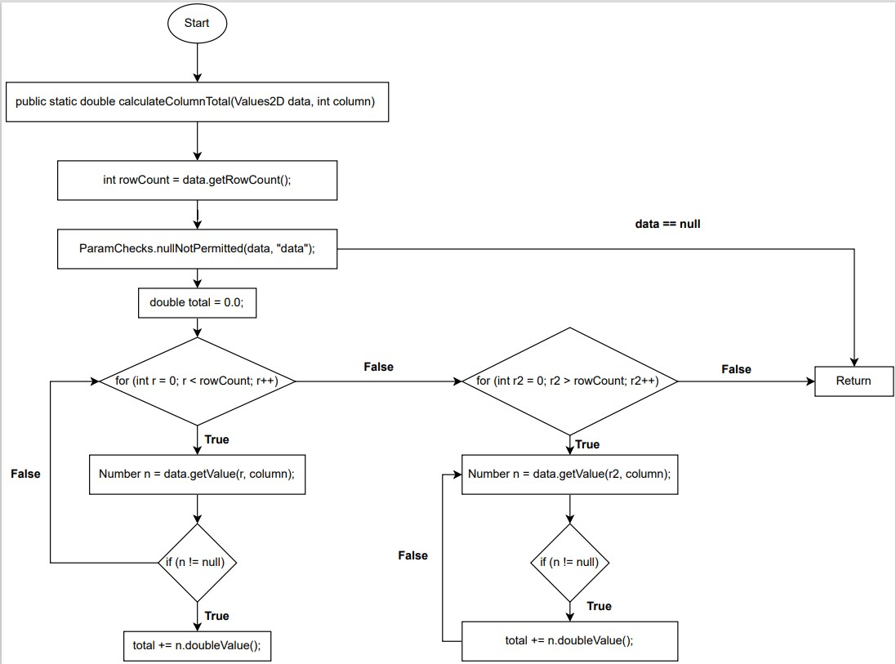
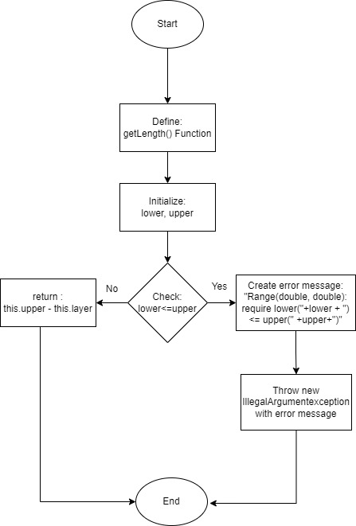
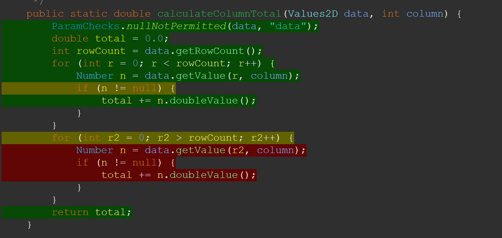
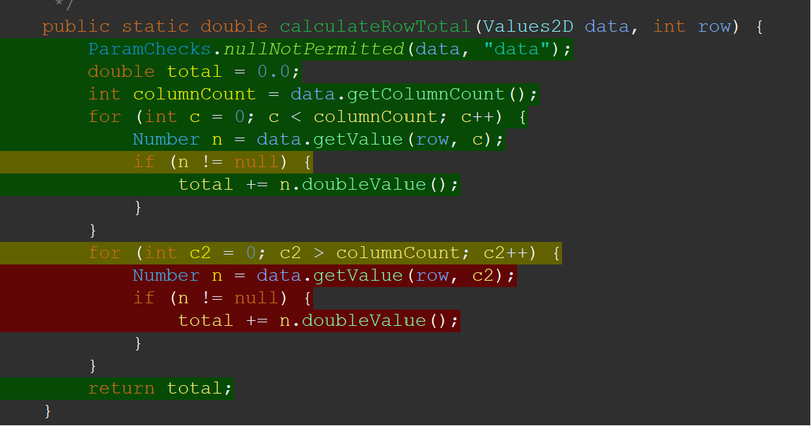
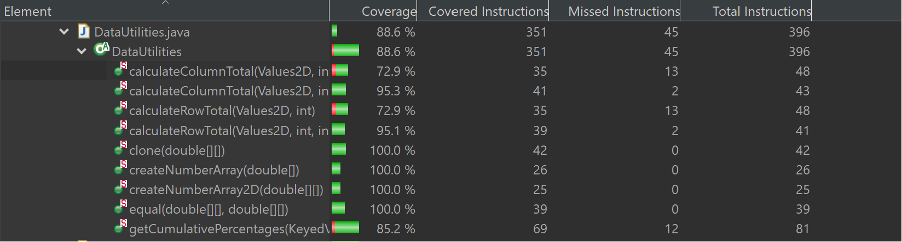
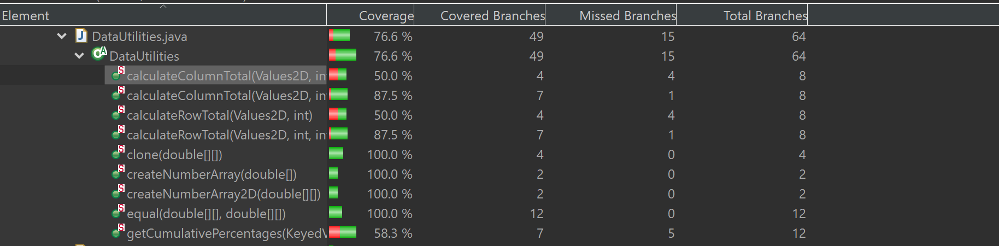
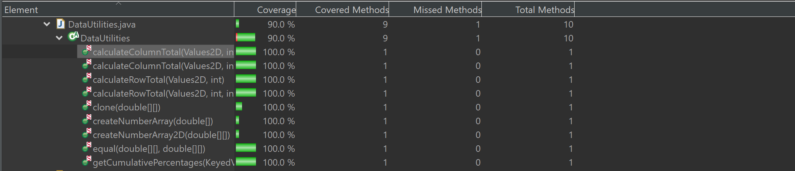

**SENG 637 - Dependability and Reliability of Software Systems**

**Lab. Report #3 – Code Coverage, Adequacy Criteria and Test Case Correlation**

| Group \#:      | 20    |
| -------------- | --- |
| Student Names: |     |
|    Usman            |     |
|    Gopal            |     |
|    Jubayer            |     |
|    Robby            |     |
|    Ehsan            |     |


# 1 Introduction

This lab report presents the efforts and outcomes of our team in enhancing unit tests for the JFreeChart library using coverage tools such as EclEmma. Our team collaborated to improve the testing coverage of the software under test (SUT) by applying various white-box testing techniques.

In this lab, we built upon our previous assignment by focusing on improving the coverage of unit tests through the utilization of coverage tools and manual data-flow coverage calculations. By drawing data flow graphs and deriving def-use pairs, we aimed to enhance the effectiveness of our test cases and ensure comprehensive coverage of the codebase.

# 2 Manual data-flow coverage calculations for X and Y methods





# 3 A detailed description of the testing strategy for the new unit test

Our team, consisting of Gopal, Usman, Jubayer, Robby, and Ehsaan, devised a comprehensive testing strategy to ensure thorough coverage and effective testing of the new unit. We began by utilizing coverage tools to identify areas requiring improvement and to guide the creation of new test cases.

Usman took the lead in writing unit tests for previously uncovered methods in DataUtilities and Range, including clone(), equals(), and variations of calculateColumnTotal and calculateRowTotal. Emphasis was placed on designing new tests to meet coverage requirements by considering boundary and branch decisions.

Gopal focused on addressing poor coverage performance in existing tests, particularly in methods like equals() in the Range class. By identifying areas of low coverage within methods, adjustments were made to existing tests to cover these segments effectively.

Jubayer emphasized the utility of coverage tools in identifying missed branches and guiding the creation of new test cases. This white-box approach aided in understanding method purposes and enhancing unit testing practices.

Robby's strategy involved a thorough understanding of each method's functionality, followed by the identification of key test cases. Ehsaan played a crucial role in achieving comprehensive code coverage, enabling us to systematically test each method individually.

Overall, our strategy prioritized thorough method coverage, guided by insights from coverage tools and a systematic approach to test case creation, ensuring the robustness and reliability of our unit testing process.

# 4 A high level description of five selected test cases you have designed using coverage information, and how they have increased code coverage
## DataUtilities Methods
We were unable to achieve proper statement coverage due to unreachable code in calculateColumnTotal and calculateRowTotal methods in the DataUtilities class.

### calculateColumnTotal
We were unable to achieve proper statement coverage in part due to calculateColumnTotal class.


As you can see above, the red code is unreachable and therefore we cannot increase the statement coverage
#ADD MORE

### calculateRowTotal
We were unable to achieve proper statement coverage in part due to calculateRowTotal class.


As you can see above, the red code is unreachable and therefore we cannot increase the statement coverage

### invalidRangePassed

The statement coverage for the equal(Object) function in the Range class was initially low following the execution of test cases from assignment 2. Upon closer examination, it was discovered that the equal function includes a conditional flow to check for objects that are not of the type "Range," and it handles such cases by returning false. After incorporating a specific unit test, the statement coverage was successfully increased to 100%.

```
 @Test
 public void invalidRangePassed() {
     testRange = new Range(-1, 1);
     assertFalse("Ranges should not be equal", testRange.equals(new Object()));
 }
```

### testCombineIgnoringNaNWithMinAndMax
The private methods, min(double1, double2) and max(double1, double2), within the Range class, serve as auxiliary functions for the public testCombineIgnoringNaNWithMinAndMax() method. In the previous lab, these min and max functions were entirely overlooked, resulting in 0% coverage for lines, methods, and branches. Following the inclusion of the provided unit test below the method, the coverage for min and max reached increased significantly for lines, methods, and branches, respectively.

```
@Test

public void testCombineIgnoringNaNWithMinAndMax() {
double NaN1 = Math.sqrt(-100); 
double NaN2 = Math.sqrt(-4); 
Range range = new Range(0, 4);
Range result = Range.combineIgnoringNaN(range, new Range(NaN1,NaN2));
assertEquals("The lower bound is", result.getLowerBound(), 0, .000000001d);
}
```
### combineValidRange_NanRange
```
    // Verifies that combineIgnoringNaN returns the false if second range is NaN
    @Test
    public void combineValidRange_NanRange(){
      Range validRange = new Range(0, 5);
      Range nanRange = new Range(Double.NaN,Double.NaN);
      Range result = Range.combineIgnoringNaN(validRange, nanRange);
      assertFalse(result.isNaNRange());
    }
```

#ADD MORE

Text…

# 5 A detailed report of the coverage achieved of each class and method (a screen shot from the code cover results in green and red color would suffice)

# 1. Range 
## Statement


## Branch


## Method


# 2. DataUtilities 
## Statement


## Branch


## Method



# 6 Pros and Cons of coverage tools used and Metrics you report

# Pros:

## Easy Integration:
Both Gopal and Usman found that EclEmma integrated smoothly with Eclipse, reducing setup time and streamlining the testing process.

## Visualization: 
Jubayer highlighted the advantage of visualizing branch, method, and statement coverages with percentage indicators, making it easier to assess the extent of test coverage.

## Comprehensive Reports: 
Robby appreciated EclEmma's detailed coverage reports, which facilitated the identification of areas requiring further testing.

## Highlighting Features:
Ehsaan noted EclEmma's feature to highlight covered and uncovered parts of the code, enhancing comprehensibility and aiding in identifying areas for improvement.

# Cons:

## IDE Dependency: 
Gopal mentioned the need to switch from VSCode to Eclipse to use EclEmma, which could disrupt the development environment and workflow.

## Limited Metrics: 
EclEmma lacks certain metrics like condition and path coverage, which may limit its effectiveness in providing a comprehensive understanding of test coverage.

## Lack of Specificity: 
Both Usman and Jubayer pointed out the challenge of not having clear highlights on specific missed lines of code, requiring additional effort to identify potential gaps in test coverage.

## Language Limitation: 
Robby highlighted that EclEmma is limited to Java and does not support other programming languages like C++ or Python, which could be a drawback for projects involving multiple languages.

Overall, while coverage tools like EclEmma offer several benefits such as ease of use and comprehensive reporting, they also have limitations related to their integration, metrics coverage, specificity, and language support. These factors should be considered when selecting a coverage tool for testing projects.

# 7 A comparison on the advantages and disadvantages of requirements-based test generation and coverage-based test generation.


# Advantages of Requirements-Based Testing:

## Effective for Complexity: 
Particularly useful for large or complex code segments where understanding the requirements is crucial for testing comprehensively.

## Black Box Testing:
Testers do not need access to the code, enabling them to test the software from a user's perspective without being influenced by internal implementation details.

## User vs. Developer Perspective: 
Helps in identifying discrepancies between user expectations and developer implementations, leading to more user-centric testing.

# Disadvantages of Requirements-Based Testing:

## Inefficiency: 
Testers may lack knowledge about the software's internal details, leading to inefficient testing and potential gaps in coverage.

## Limited Scope:
Only specific scenarios are tested, potentially missing edge cases and leading to incomplete bug discovery.

## Poor Documentation: 
Insufficient documentation on methods and classes can hinder the writing of unit tests, making it challenging to ensure comprehensive coverage.

# Advantages of Coverage-Based Testing:

## Analyzable Metrics:
Coverage tools provide easy-to-analyze and unbiased metrics, helping testers assess the extent of test coverage more objectively.

## Access to Code:
Testers have access to the code, enabling them to use logical reasoning to identify bugs and security issues more effectively.

## Understanding Code Usage: 
Allows testers to gain a better understanding of where specific methods and classes are used and their intended purpose within the application.

# Disadvantages of Coverage-Based Testing:

## Lack of Critical Section Coverage:
Does not guarantee coverage of critical sections of the code, as coverage tools cannot determine which methods or sections are critical to the application's functionality.

## Tool Selection Complexity:
With many coverage tools available, it can be challenging to determine which tool best suits the project's needs.

## Knowledge and Access Requirements: 
Testers need extensive knowledge about the System Under Test (SUT) and access to the code, which may not always be feasible.

## Focus on Code Coverage Over Edge Cases:
There's a risk that testers may prioritize writing tests to achieve high code coverage instead of focusing on testing edge cases that the code may not handle adequately.

# 8 A discussion on how the team work/effort was divided and managed

## Gopal:
Focused on writing new test cases and enhancing existing ones for specific methods in both DataUtilities and Range classes. Also, contributed to drawing the Data Flow Diagram (DFD), derived def-use pairs, and calculated coverage for certain methods.

## Usman:
Worked on improving old test cases and creating new ones for designated methods within DataUtilities and Range classes. His efforts were particularly concentrated on methods such as clone, equal, equals, constrain, intersects, contains, getLowerBound, and getUpperBound.

## Jubayer: 
Similar to Usman, Jubayer concentrated on enhancing existing test cases and crafting new ones for assigned methods in both DataUtilities and Range classes. His focus was on methods like getCumulativePercentages, combine, combineIgnoreNaN, Scale, Range, and hashCode. Additionally, he undertook the task of manually calculating data flow coverage for specific methods.

## Robby:
Robby's responsibilities involved refining and developing new test cases for specified methods in DataUtilities and Range classes. He specifically targeted methods like createNumberArray, createNumberArray2D, toString, expandToInclude, isNaNRange, shift, and shiftWithNoZeroCrossing.

## Ehsaan:
Despite dividing the testing tasks among team members, there was a collective effort towards reviewing each other's unit tests. This collaborative approach ensured that all test cases were thorough and met the required standards, fostering a cohesive and effective team dynamic.

# 9 Any difficulties encountered, challenges overcome, and lessons learned from performing the lab

## Gopal: 
Initially, grappling with understanding the functionality of EclEmma posed a challenge due to lack of prior experience with the tool. Additionally, discrepancies in coverage values between lab 2 and lab 3 prompted further research and consultation of lecture notes to resolve. Crafting the Data Flow Diagram (DFD) and deriving def-use pairs for coverage calculation also presented challenges that required additional effort.

## Usman: 
Encountered difficulty in accessing certain blocks of code within methods like getUpperBound() and getLowerBound() due to logic being copied over from constructors, indicating potential issues with code design. However, this highlighted the importance of identifying and addressing such design flaws, even if it reduces coverage. This experience emphasized the significance of thorough code review and design considerations.

## Jubayer:
Identified an issue in the getCumulativePercentages function where a for loop remained inaccessible due to a bug in the code, resulting in coverage falling below 90%. This underscored the value of unit tests in uncovering bugs and defects, highlighting the collaborative effort required between testers and developers to ensure robust code quality. Additionally, it shed light on the role of individual developers in contributing to test coverage and code quality.

## Robby: 
Encountered difficulty in understanding and implementing the "shift" method for the Range class, requiring further research and feedback incorporation to overcome. Despite initial challenges, adapting to the usage of EclEmma and navigating through the complexities of the assignment provided valuable learning experiences in testing practices and code analysis.

## Ehsaan: 
Acknowledged the initial confusion in using EclEmma, which was gradually overcome through adaptation and practice. Despite facing increased difficulty compared to previous assignments, the experience served as a valuable exercise in honing testing practices and navigating through complex testing scenarios. Emphasized the importance of perseverance and continuous learning in tackling challenging assignments effectively.

# 10 Comments/feedback on the lab itself

## Gopal: 
The lab provided valuable insights into coverage-based testing and its effectiveness in evaluating test coverage. However, clearer instructions regarding the scope of improvements required in test cases would have been beneficial. Visual aids could enhance understanding and streamline the testing process further.

## Usman: 
The lab offered a practical opportunity to assess test coverage and improve testing strategies. Clearer instructions with visual aids would enhance comprehension and facilitate smoother execution of the tasks. Overall, the experience contributed positively to enhancing software testing capabilities.

## Jubayer:
Compared to previous assignments, the lab and coverage-based testing proved to be more effective, providing a clearer understanding of method functionality and facilitating the identification of potential unit tests. However, enhanced clarity in instructions would improve the overall experience and streamline the testing process.

## Robby: 
Building upon previous assignments, the lab provided valuable insights into coverage-based testing and its role in enhancing software testing capabilities. Clear instructions contributed to a better understanding of the tasks, although additional visual aids could further enhance comprehension and streamline execution.

## Ehsaan: 
The lab offered a valuable opportunity to enhance software testing capabilities through coverage-based testing. Clear instructions contributed to a better understanding of the tasks, although there is room for improvement in providing additional visual aids to enhance comprehension further. Overall, the experience was beneficial in improving testing strategies and understanding coverage metrics.
